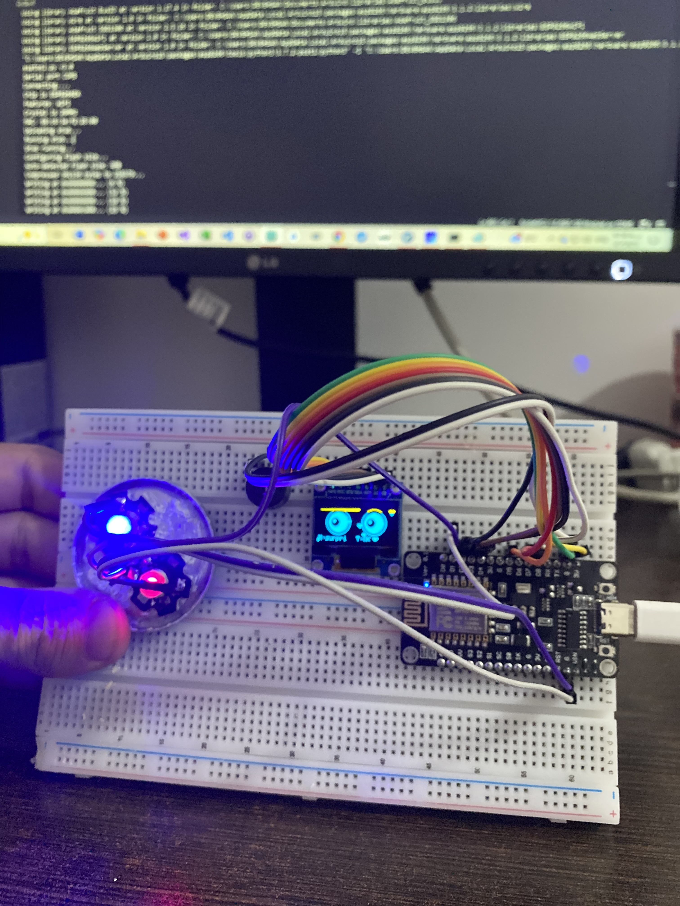
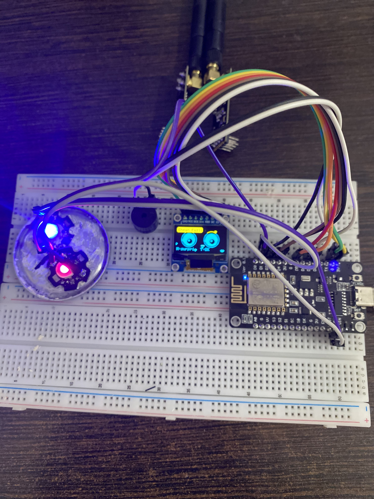
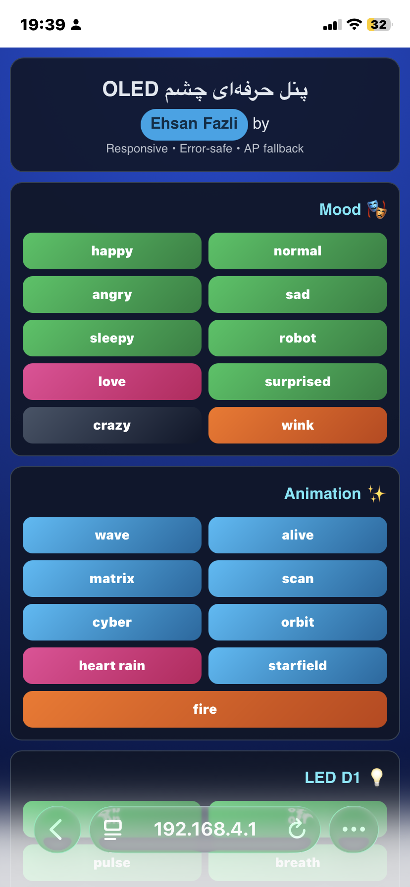

#  🎯 Ultimate OLED Eye Controller

<div align="center">


<svg width="700" height="220" viewBox="0 0 700 220" xmlns="http://www.w3.org/2000/svg">
  <defs>
    <linearGradient id="eyeGrad" x1="0%" y1="0%" x2="100%" y2="100%">
      <stop offset="0%" style="stop-color:#10b981;stop-opacity:1" />
      <stop offset="50%" style="stop-color:#3b82f6;stop-opacity:1" />
      <stop offset="100%" style="stop-color:#8b5cf6;stop-opacity:1" />
    </linearGradient>
    <filter id="glow">
      <feGaussianBlur stdDeviation="4" result="coloredBlur"/>
      <feMerge>
        <feMergeNode in="coloredBlur"/>
        <feMergeNode in="SourceGraphic"/>
      </feMerge>
    </filter>
    <linearGradient id="bgGrad" x1="0%" y1="0%" x2="100%" y2="100%">
      <stop offset="0%" style="stop-color:#0f172a;stop-opacity:1" />
      <stop offset="100%" style="stop-color:#1e293b;stop-opacity:1" />
    </linearGradient>
  </defs>
  
  <rect width="700" height="220" fill="url(#bgGrad)" rx="20"/>
  
  <!-- Left Eye -->
  <ellipse cx="230" cy="110" rx="70" ry="45" fill="url(#eyeGrad)" filter="url(#glow)" opacity="0.9"/>
  <circle cx="230" cy="110" r="30" fill="#0f172a"/>
  <circle cx="225" cy="105" r="10" fill="#ffffff"/>
  <circle cx="240" cy="115" r="4" fill="#ffffff" opacity="0.7"/>
  
  <!-- Right Eye -->
  <ellipse cx="470" cy="110" rx="70" ry="45" fill="url(#eyeGrad)" filter="url(#glow)" opacity="0.9"/>
  <circle cx="470" cy="110" r="30" fill="#0f172a"/>
  <circle cx="465" cy="105" r="10" fill="#ffffff"/>
  <circle cx="480" cy="115" r="4" fill="#ffffff" opacity="0.7"/>
  
  <!-- Circuit Lines -->
  <path d="M150 110 L180 110 M520 110 L550 110" stroke="#10b981" stroke-width="2" opacity="0.6"/>
  <circle cx="150" cy="110" r="3" fill="#10b981"/>
  <circle cx="550" cy="110" r="3" fill="#10b981"/>
  
  <!-- Title -->
  <text x="350" y="190" font-family="'Segoe UI', Arial, sans-serif" font-size="28" font-weight="300" text-anchor="middle" fill="#ffffff">
    EHSAN FAZLI
  </text>
  <text x="350" y="210" font-family="'Segoe UI', Arial, sans-serif" font-size="14" text-anchor="middle" fill="#64748b">
    Embedded Systems Developer
  </text>
</svg>

**My First Professional Project in Microcontrollers & IoT**

Advanced OLED Eye Controller with Unmatched Animation, Sound & Web Control Capabilities

</div>

---
### shots

<div align="center">


  
  

</div>

## 📖 Project Overview

This project is an intelligent control system for displaying animated eyes on a 128x64 OLED display, powered by ESP8266. It features diverse animations, multiple eye states, sound control, smart LED, and a full-featured web panel for remote management.

### ✨ Key Features

- 🎭 **10 Eye States**: Normal, Happy, Sad, Angry, Robot, Sleepy, Surprised, Love, Wink, Crazy
- 🌊 **9 Advanced Animations**: Alive, Wave, Scan, Matrix, Orbit, Cyber, Starfield, Heart Rain, Fire
- 🕐 **Iran Clock with Auto-Sync**: Accurate Iran time display with automatic synchronization
- 🎵 **Sound System with Multiple Melodies**: Startup, Happy, Love, Cool, Bass, Random
- 💡 **Smart LED with 7 Modes**: Off, On, Breath, Pulse, Strobe, Heartbeat, Follow
- 🌐 **Responsive Web Panel**: Full control via browser with modern design
- 📶 **Advanced WiFi Management**: Auto-connect, AP mode, network scanning
- 📝 **Custom Text Display on OLED**

---

## 🛠️ Hardware Requirements

| Component | Quantity | Description |
|-----------|----------|-------------|
| ESP8266 (NodeMCU/WEMOS) | 1 | Main microcontroller |
| OLED 128x64 (SSD1306) | 1 | Eye display |
| Buzzer (Piezo) | 1 | Sound generation |
| LED (D1) | 1 | Smart indicator |
| 220Ω Resistor | 1 | LED protection |
| Breadboard & Wires | - | Assembly |

---

## 🚀 Installation & Setup

### 1. Environment Preparation

```bash
# Install required libraries in Arduino IDE
- SSD1306 by Adafruit
- ESP8266WiFi by ESP8266
- ESP8266WebServer by ESP8266
- NTPClient by Fabrice Weinberg
```

### 2. Initial Configuration

```cpp
// Edit the configuration section in the code:
const String wifiSsid = "YOUR_WIFI_SSID";
const String wifiPassword = "YOUR_WIFI_PASSWORD";
const String apSsid = "EyeMaster-AP";
const String apPassword = "12345678";
```

### 3. Upload Code

1. Connect ESP8266 board to computer
2. Select correct serial port
3. Upload the code

### 4. Access Control Panel

- **STA Mode**: `http://[IP_ADDRESS]`
- **AP Mode**: `http://192.168.4.1`

---

## 🎮 Usage Guide

### Web Control Panel

<div align="center">


</div>

#### Panel Sections:

1. **🎭 Mood**: Change eye state
2. **✨ Animation**: Select background animation
3. **💡 LED D1**: Control smart LED
4. **📶 WiFi Management**: Manage network connection
5. **📝 Text to OLED**: Send custom text
6. **🕒 Iran Clock**: Iran clock settings

### Quick Controls

```cpp
// Change eye state
GET /mood?state=happy

// Change animation
GET /anim?mode=wave

// Control LED
GET /led?mode=breath

// Display text
GET /display/text?msg=Hello World

// Sync time
GET /time/sync
```

---

## 🎨 Animation Gallery

<svg width="900" height="120" viewBox="0 0 900 120" xmlns="http://www.w3.org/2000/svg">
  <defs>
    <linearGradient id="cardGrad" x1="0%" y1="0%" x2="0%" y2="100%">
      <stop offset="0%" style="stop-color:#1e293b;stop-opacity:1" />
      <stop offset="100%" style="stop-color:#0f172a;stop-opacity:1" />
    </linearGradient>
  </defs>
  
  <!-- Wave Animation -->
  <g transform="translate(0, 0)">
    <rect width="100" height="100" rx="12" fill="url(#cardGrad)" stroke="#334155" stroke-width="1"/>
    <path d="M20 50 Q30 40, 40 50 T60 50 T80 50" stroke="#10b981" stroke-width="3" fill="none" opacity="0.8"/>
    <text x="50" y="115" font-size="11" text-anchor="middle" fill="#e2e8f0">Wave</text>
  </g>
  
  <!-- Matrix Animation -->
  <g transform="translate(110, 0)">
    <rect width="100" height="100" rx="12" fill="url(#cardGrad)" stroke="#334155" stroke-width="1"/>
    <text x="25" y="35" font-size="14" fill="#10b981" font-family="monospace">01</text>
    <text x="60" y="55" font-size="14" fill="#10b981" font-family="monospace">10</text>
    <text x="35" y="75" font-size="14" fill="#10b981" font-family="monospace">11</text>
    <text x="50" y="115" font-size="11" text-anchor="middle" fill="#e2e8f0">Matrix</text>
  </g>
  
  <!-- Heart Animation -->
  <g transform="translate(220, 0)">
    <rect width="100" height="100" rx="12" fill="url(#cardGrad)" stroke="#334155" stroke-width="1"/>
    <path d="M50 30 C35 15, 5 15, 5 45 C5 75, 50 85, 50 85 C50 85, 95 75, 95 45 C95 15, 65 15, 50 30Z" fill="#ec4899" opacity="0.9"/>
    <text x="50" y="115" font-size="11" text-anchor="middle" fill="#e2e8f0">Heart Rain</text>
  </g>
  
  <!-- Fire Animation -->
  <g transform="translate(330, 0)">
    <rect width="100" height="100" rx="12" fill="url(#cardGrad)" stroke="#334155" stroke-width="1"/>
    <path d="M50 75 L35 45 L42 52 L25 30 L35 40 L15 15 L50 50 L85 15 L65 40 L75 30 L58 52 L65 45 L50 75" fill="#f97316" opacity="0.9"/>
    <text x="50" y="115" font-size="11" text-anchor="middle" fill="#e2e8f0">Fire</text>
  </g>
  
  <!-- Cyber Animation -->
  <g transform="translate(440, 0)">
    <rect width="100" height="100" rx="12" fill="url(#cardGrad)" stroke="#334155" stroke-width="1"/>
    <rect x="20" y="20" width="60" height="60" stroke="#06b6d4" stroke-width="2" fill="none" opacity="0.8"/>
    <circle cx="50" cy="50" r="20" stroke="#06b6d4" stroke-width="2" fill="none" opacity="0.8"/>
    <circle cx="50" cy="50" r="5" fill="#06b6d4" opacity="0.8"/>
    <text x="50" y="115" font-size="11" text-anchor="middle" fill="#e2e8f0">Cyber</text>
  </g>
  
  <!-- Starfield Animation -->
  <g transform="translate(550, 0)">
    <rect width="100" height="100" rx="12" fill="url(#cardGrad)" stroke="#334155" stroke-width="1"/>
    <circle cx="25" cy="25" r="2" fill="#ffffff" opacity="0.9"/>
    <circle cx="75" cy="35" r="2" fill="#ffffff" opacity="0.7"/>
    <circle cx="50" cy="55" r="2" fill="#ffffff" opacity="0.8"/>
    <circle cx="35" cy="70" r="2" fill="#ffffff" opacity="0.6"/>
    <circle cx="80" cy="75" r="2" fill="#ffffff" opacity="0.9"/>
    <circle cx="60" cy="80" r="2" fill="#ffffff" opacity="0.5"/>
    <text x="50" y="115" font-size="11" text-anchor="middle" fill="#e2e8f0">Starfield</text>
  </g>
  
  <!-- Orbit Animation -->
  <g transform="translate(660, 0)">
    <rect width="100" height="100" rx="12" fill="url(#cardGrad)" stroke="#334155" stroke-width="1"/>
    <circle cx="50" cy="50" r="8" fill="#8b5cf6" opacity="0.9"/>
    <circle cx="50" cy="30" r="3" fill="#a78bfa" opacity="0.8"/>
    <circle cx="70" cy="50" r="3" fill="#a78bfa" opacity="0.8"/>
    <circle cx="50" cy="70" r="3" fill="#a78bfa" opacity="0.8"/>
    <circle cx="30" cy="50" r="3" fill="#a78bfa" opacity="0.8"/>
    <text x="50" y="115" font-size="11" text-anchor="middle" fill="#e2e8f0">Orbit</text>
  </g>
  
  <!-- Alive Animation -->
  <g transform="translate(770, 0)">
    <rect width="100" height="100" rx="12" fill="url(#cardGrad)" stroke="#334155" stroke-width="1"/>
    <ellipse cx="40" cy="45" rx="12" ry="15" fill="#22c55e" opacity="0.8"/>
    <ellipse cx="60" cy="45" rx="12" ry="15" fill="#22c55e" opacity="0.8"/>
    <circle cx="40" cy="45" r="6" fill="#0f172a"/>
    <circle cx="60" cy="45" r="6" fill="#0f172a"/>
    <circle cx="42" cy="43" r="2" fill="#ffffff"/>
    <circle cx="62" cy="43" r="2" fill="#ffffff"/>
    <text x="50" y="115" font-size="11" text-anchor="middle" fill="#e2e8f0">Alive</text>
  </g>
</svg>

---

## 🔧 Project Structure

```
├── src/
│   └── eye_controller.ino    # Main project code
├── img/
│   ├── shot.png              # Desktop screenshot
│   └── shot1.png             # Mobile screenshot
├── README.md                 # Project documentation
└── .gitignore               # Ignored files
```

---

## 🎯 Future Roadmap

- [ ] 🤖 Smart eye mode with face detection
- [ ] 🌈 Support for color displays
- [ ] 📱 Android & iOS mobile apps
- [ ] 🎮 Joystick and sensor control
- [ ] ☁️ Cloud settings storage
- [ ] 🔄 OTA (Over-The-Air) updates

---

## 🤝 Contributing

To contribute to this project:

1. Fork the project
2. Create a new branch (`git checkout -b feature/AmazingFeature`)
3. Commit your changes (`git commit -m 'Add some AmazingFeature'`)
4. Push to the branch (`git push origin feature/AmazingFeature`)
5. Open a Pull Request

---

## 📄 License

This project is licensed under the **MIT** License. See the [LICENSE](LICENSE) file for more information.

---

## 🙏 Special Thanks

- **Family and Friends** for endless support
- **Arduino Open Source Community** for excellent libraries
- **GitHub Users** for valuable feedback

---

<div align="center">

<svg width="500" height="80" viewBox="0 0 500 80" xmlns="http://www.w3.org/2000/svg">
  <defs>
    <linearGradient id="contactGrad" x1="0%" y1="0%" x2="100%" y2="0%">
      <stop offset="0%" style="stop-color:#10b981;stop-opacity:1" />
      <stop offset="50%" style="stop-color:#3b82f6;stop-opacity:1" />
      <stop offset="100%" style="stop-color:#8b5cf6;stop-opacity:1" />
    </linearGradient>
  </defs>
  
  <rect width="500" height="80" rx="15" fill="#1e293b" opacity="0.5"/>
  
  <text x="250" y="30" font-family="'Segoe UI', Arial, sans-serif" font-size="16" font-weight="600" text-anchor="middle" fill="#ffffff">
    Contact Developer
  </text>
  
  <g transform="translate(150, 45)">
    <circle cx="0" cy="0" r="15" fill="url(#contactGrad)" opacity="0.2"/>
    <path d="M-7 -3 L-7 3 L-3 3 L3 7 L3 -7 L-3 -3 L-7 -3Z" fill="url(#contactGrad)"/>
    <text x="25" y="5" font-size="14" fill="#e2e8f0">GitHub: tsshack</text>
  </g>
  
  <g transform="translate(150, 65)">
    <circle cx="0" cy="0" r="15" fill="url(#contactGrad)" opacity="0.2"/>
    <path d="M-5 -5 L5 -5 L5 5 L-5 5 Z M-2 -2 L2 -2 M-2 2 L2 2" stroke="url(#contactGrad)" stroke-width="2" fill="none"/>
    <text x="25" y="5" font-size="14" fill="#e2e8f0">Telegram: abj0o</text>
  </g>
</svg>

**Made by Ehsan Fazli**

[](https://github.com/tsshack)
[](https://t.me/abj0o)

</div>
